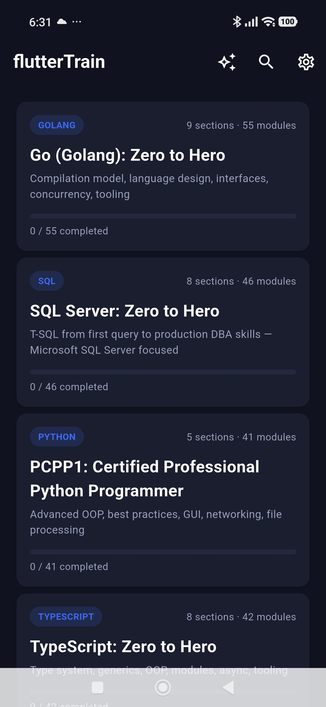
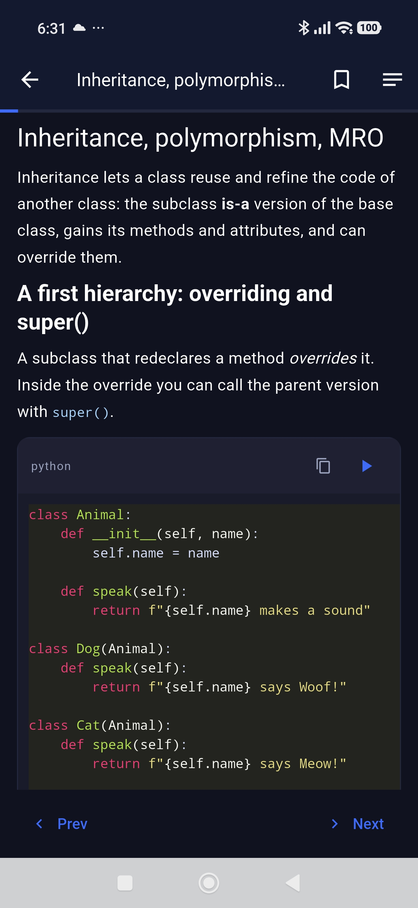
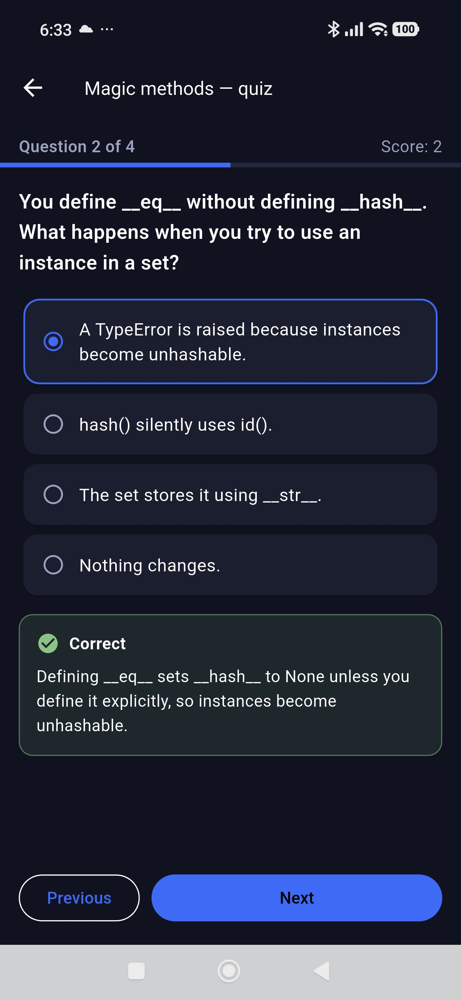

# flutterTrain

A fully offline training harness for the **Android** platform. flutterTrain is a
Flutter app that runs interactive programming courseware — lessons, runnable
code examples, quizzes, and a timed exam simulator — with the code executed
**on-device** by two embedded language engines.

| Engine | Technology | Modules |
|---|---|---|
| Python | Chaquopy 17 (bundles CPython 3.13) | runnable code blocks |
| Go | `yaegi` interpreter bound via `gomobile bind` (`.aar`) | runnable code blocks |
| SQL (T-SQL) / TypeScript | none (no on-device engine) | display-only examples |

Courseware and app runtime both work **without a network connection**. The app
loads bundled content from a precompiled asset pack and stores progress, notes,
and bookmarks locally. To get help from an AI assistant, share any lesson or
quiz question as a Markdown file to the assistant app of your choice.

## Screenshots

| Course library | Lesson with runnable code | Quiz |
|---|---|---|
|  |  |  |

## Contents

- [Screenshots](#screenshots)
- [Features](#features)
- [Repository layout](#repository-layout)
- [Architecture](#architecture)
- [Bundled courseware](#bundled-courseware)
- [Getting started](#getting-started)
- [Building the APK](#building-the-apk)
- [Content authoring](#content-authoring)
- [Tooling & validation](#tooling--validation)
- [Testing](#testing)
- [Documentation](#documentation)

## Features

- **4 offline courses (184 modules across 30 sections)** — Python (PCPP-32-101),
  Go, SQL Server, and TypeScript. Each course bundles lessons and a full exam
  simulator with section-weighted question drawing.
- **On-device code runner** — Python blocks run under the embedded CPython;
  Go blocks run in the embedded `yaegi` interpreter. A Run button executes the
  block (10-second timeout) and shows stdout/errors; copy is always available.
  Blocks that can't run on-device (GUI apps, network-dependent code, some Go
  generics) are tagged `eval=no` and show copy only.
- **Rich Markdown reader** — prose, syntax-highlighted code blocks, GitHub-style
  callouts (`> [!note]`, `> [!tip]`, `> [!warning]`, `> [!trap]`, `> [!key]`),
  and per-lesson quizzes with multi-select grading and explanations.
- **Exam simulator** — timed mock exams (e.g. 45 questions / 65 minutes /
  70% pass for PCPP1) drawing proportionally from exam section weights. Timer
  hard-stops at zero; score, pass/fail threshold, and retry flow are built in.
- **Progress tracking** — per-module completion, quiz best score/attempts, saved
  reading position, bookmarks, and personal notes. Persisted to local SQLite.
- **Search** — full-text search across lesson titles and body text with keyword
  highlighting.
- **Practice mode** — rapid-fire mixed-question drill from a course's entire
  question bank.
- **Share as Markdown** — the share button on a lesson or quiz question sends
  the page as a `.md` file through the Android share sheet, ready to hand to
  an AI assistant or any other app. Timed exams hide the button, and a quiz
  question includes its answer only after you answer it correctly.
- **Settings** — progress export to JSON and reset-all-progress.

## Repository layout

```
flutterTrain/
├── courseware/                  # source course content (authoring ground truth)
│   ├── python-pcpp1/            #   PCPP1 certification course
│   ├── golang/                  #   Go: Zero to Hero
│   ├── mssql/                   #   SQL Server: Zero to Hero (display-only)
│   └── typescript/              #   TypeScript: Zero to Hero (display-only)
├── flutter_train/               # the Flutter application
│   ├── lib/
│   │   ├── main.dart            #   entry point, dark theme, error shell
│   │   ├── core/                #   content engine, code runner, search, progress, state
│   │   ├── models/              #   Course / Section / Module data model
│   │   ├── screens/             #   home, course, lesson, quiz, practice, search, settings
│   │   └── widgets/             #   code block + content renderer widgets
│   ├── go/                      #   Go engine source (yaegi bind target)
│   ├── android-overlay/         #   Gradle/Chaquopy/sandbox overlay (source of truth for android/)
│   ├── assets/courseware/       #   build output: courseware + pack.json (git-ignored)
│   └── test/                    #   widget/unit tests
├── tools/                       # build + content tooling (see below)
├── docs/                        # BUILD.md, QA_CHECKLIST.md, AGENT_GUIDE.md
└── COURSEWARE_FORMAT.md         # on-disk spec for course content
```

The `flutter_train/` project is generated once with `flutter create`; the
checkin-ignored platform scaffolding is rebuilt by the tooling and the committed
`android-overlay/` is merged on top by the build script.

## Architecture

**Content pipeline.** Course source lives in `courseware/<course-id>/` as
Markdown modules with YAML front matter plus a `manifest.json` per course
(`COURSEWARE_FORMAT.md`). The build script rsyncs it into the app's assets and
`tools/export_content.py` flattens all courses into a single
`assets/courseware/pack.json`, which the Flutter app loads. Because Android's
asset API cannot enumerate directories, the pack file is the single content
entry point.

**Content engine** (`flutter_train/lib/core/content_engine.dart`). Parses the
pack, discovers bundled and user-installed courses (user content can be dropped
into `Documents/courseware/` on-device and is overlaid on the bundled set), and
renders modules into typed blocks: prose, callout, code, and quiz.

**Code runner** (`flutter_train/lib/core/code_runner.dart`).
- *Python*: a method channel talks to the Python sandbox hosted by Chaquopy on a
  worker thread (`android-overlay/app/src/main/python/sandbox.py`); output is
  captured as text with a ~10s timeout.
- *Go*: a second method channel invokes the `yaegi` interpreter compiled to an
  `.aar` by `gomobile bind` (`flutter_train/go/engine.go`).

**State & persistence.** `AppState` (a `ChangeNotifier`) owns the loaded library
and per-module progress, which is persisted to SQLite through
`ProgressRepository`, plus the documents-directory content overlay.

## Bundled courseware

| Course | Language | Sections / Modules | Runner |
|---|---|---|---|
| PCPP1: Certified Professional Python Programmer | Python | 5 / 41 | ✅ Chaquopy |
| Go (Golang): Zero to Hero | Go | 9 / 55 | ✅ yaegi |
| SQL Server: Zero to Hero | T-SQL | 8 / 46 | display-only |
| TypeScript: Zero to Hero | TypeScript | 8 / 42 | display-only |

## Getting started

> The repo tracks the application source, courseware, and tooling; the Flutter
> project's generated Android scaffolding and prebuilt Go `.aar` are build
> artifacts, not committed. Follow the build steps below to reproduce them.

Prerequisites are outlined in `docs/BUILD.md` (Flutter ≥ 3.22, Android SDK
API 34–35, JDK 17, Go ≥ 1.22, gomobile, rsync).

To build the release APK and install it on a device:

```bash
# 1. (once) generate the Flutter project scaffolding
flutter create --org com.fluttertrain --project-name flutter_train --platforms android flutter_train

# 2. build (rsync content + overlay, pack, gomobile bind, flutter build apk)
tools/build_apk.sh

# 3. install
adb install -r flutter_train/build/app/outputs/flutter-apk/app-release.apk
```

The release build signs with the debug key for easy side-loading; add a real
signing config under `android-overlay/app/build.gradle` for Play Store release.

See [docs/BUILD.md](docs/BUILD.md) for full details, including the
offline first-run verification checklist.

## Building the APK

`tools/build_apk.sh` performs, in order:

1. rsync `courseware/` → `flutter_train/assets/courseware/` (delete-stale)
2. `tools/export_content.py` → `assets/courseware/pack.json`
3. rsync `android-overlay/` → `flutter_train/android/`
4. `gomobile bind` the Go engine (only if the `.aar` is missing or
   `REBUILD_GO=1`)
5. `flutter build apk --release`

Output: `flutter_train/build/app/outputs/flutter-apk/app-release.apk`.

Refer to `docs/BUILD.md` for a troubleshooting table (NDK env vars, missing
wrapper, method-channel "No implementation found", etc.).

## Content authoring

Course content follows the spec in [`COURSEWARE_FORMAT.md`](COURSEWARE_FORMAT.md):

- One `.md` file per module with YAML front matter (`id`, `title`, `order`,
  `section`, `language`, optional `type: cheatsheet`, tags, prereqs, summary).
- Each course has a `manifest.json` declaring sections, module metadata, and
  `examMode` (question count, duration, pass percentage).
- Content blocks: prose (+ callout alerts), fenced code (runnable by default;
  `eval=no` disables the Run button), `## Quiz` YAML blocks, and course-level
  `## ExamQuestions` YAML banks for the simulator.

## Tooling & validation

| Tool | Purpose |
|---|---|
| `tools/build_apk.sh` | full build: sync content, export pack, bind Go engine, build APK |
| `tools/export_content.py` | flatten `courseware/` into `assets/courseware/pack.json` |
| `tools/validate_content.py` | validate manifests, front matter, quizzes, exam banks, code fences |
| `tools/sync_manifest.py` | regenerate manifest module lists from the filesystem |
| `tools/verify_python_examples.py` | smoke-execute runnable Python blocks offline |
| `tools/verify_go_examples.sh` | smoke-execute runnable Go blocks with yaegi |

Typical content workflow:

```bash
# after editing courseware/**
python3 tools/validate_content.py
tools/verify_python_examples.py      # runnable Python blocks must pass
tools/verify_go_examples.sh          # runnable Go blocks must pass
tools/build_apk.sh
```

## Testing

`cd flutter_train && flutter test` runs the widget/unit suite (see
`flutter_train/test/content_render_test.dart`). End-to-end acceptance checks
are documented in `docs/QA_CHECKLIST.md` — a smoke-test pass against every
release APK covering offline load, both runnable engines, quizzes, the exam
simulator, search, bookmarks/notes persistence, and the build pipeline.

## Documentation

- [`docs/BUILD.md`](docs/BUILD.md) — prerequisites, build steps, verification, troubleshooting
- [`docs/QA_CHECKLIST.md`](docs/QA_CHECKLIST.md) — release smoke-test checklist
- [`docs/AGENT_GUIDE.md`](docs/AGENT_GUIDE.md) — pointers for working on the codebase
- [`COURSEWARE_FORMAT.md`](COURSEWARE_FORMAT.md) — courseware on-disk spec